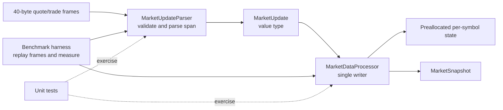

# MockMarket

MockMarket is a .NET 10 market-data processing sample built to demonstrate a low-allocation hot path: parse fixed-width feed frames from spans, update preallocated per-symbol state, and measure sustained throughput.

## Architecture



## Projects

- `MockMarket.Core` contains the binary frame parser, value-type updates and snapshots, and a fixed-capacity processor.
- `MockMarket.Benchmarks` uses BenchmarkDotNet to measure parsing, processing, and the combined hot path.
- `MockMarket.Tests` covers protocol parsing, state updates, bounds handling, and zero managed allocations in the warmed-up hot path.

## Requirements

- .NET 10 SDK (the current LTS release)

## Run

Run the test suite:

```powershell
dotnet test MockMarket.slnx -c Release
```

Run the BenchmarkDotNet suite in Release mode:

```powershell
dotnet run -c Release --project src/MockMarket.Benchmarks -- --filter "*"
```

The suite compares parsing plus processing, parsing alone, and processing already-parsed updates. Each invocation processes a preallocated batch of 4,096 quote updates across 256 symbols. BenchmarkDotNet warms up the runtime, reports allocations, and writes detailed results to `BenchmarkDotNet.Artifacts/results`.

### Benchmark results

BenchmarkDotNet run captured 2026-10-06:

| Benchmark | Mean per message | Approx. messages/second | Managed allocation |
| --- | ---: | ---: | ---: |
| Parse and process | 1.883 ns | 531 million | 0 B |
| Parse only | 1.422 ns | 703 million | 0 B |
| Process only | 1.502 ns | 666 million | 0 B |

Environment: Intel Core Ultra 7 255H, Windows 11, .NET 10.0.12 x64 RyuJIT, BenchmarkDotNet 0.15.8. These are per-update means from an in-memory microbenchmark, not a full feed/network pipeline or a production capacity guarantee. Results vary with hardware, runtime, and system load; repeat on an otherwise idle target machine for meaningful comparisons.

## Wire format

Each frame is exactly 40 bytes. Multi-byte integers are little-endian; reserved bytes must be zero. Prices are integer ticks and sizes are non-negative integer quantities. The parser rejects unknown update kinds, malformed lengths, nonzero reserved bytes, and negative prices or sizes.

| Offset | Width | Field |
| --- | ---: | --- |
| 0 | 1 | Kind: `1` quote, `2` trade |
| 1 | 4 | Symbol ID (`uint32`) |
| 5 | 8 | Timestamp in nanoseconds (`int64`) |
| 13 | 8 | Primary price (`int64`): bid for quote, last for trade |
| 21 | 8 | Secondary price (`int64`): ask for quote, unused for trade |
| 29 | 4 | Primary size (`int32`): bid size for quote, trade size for trade |
| 33 | 4 | Secondary size (`int32`): ask size for quote, unused for trade |
| 37 | 3 | Reserved; must be zero |

The processor uses symbol IDs as direct indexes into a fixed-size state array. Configure capacity to cover the IDs in the feed; out-of-range symbols are rejected explicitly. `MarketDataProcessor` is single-writer and intentionally has no internal synchronization: use one processor per feed partition/worker rather than sharing an instance across concurrent writers. Parsing and processing operate on value types and preallocated state; initialize the frame and processor before the hot loop.
